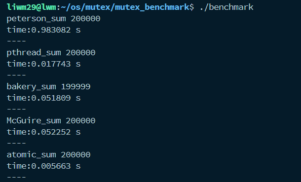

# Benchmark
### 多进程软件锁
1. Peterson算法(filter算法)
2. lamport_bakery算法
3. McGuire算法
### 硬件锁: 
1. pthread_mutex

# Inplement
### 通过累加的结果测试原子性
```c
int simple_add(int* sum) {
  (*sum)++;  // attention: ++ is prior to *
}

int atomic_add(int* sum) {
  __sync_fetch_and_add(sum, 1);
}
```
使用 `pthread_barrier_t` 保证竞态
### 锁的实现
以peterson为例,其他类同,统一设计成 `pthread/posix` 风格
```c
peterson_mutex_t peterson_mutex;

int peterson_mutex_init(peterson_mutex_t* mutex) {
  memset(mutex->level, -1, N_THREAD * sizeof(int));
  memset(mutex->waiting, -1, N_THREAD * sizeof(int));
}

int peterson_mutex_lock(peterson_mutex_t* mutex, int i){
  for (int l = 0; l < N_THREAD - 1; ++l) {
    mutex->level[i] = l;
    mutex->waiting[l] = i;
    while (mutex->waiting[l] == i && !is_highest_level(mutex, i, l)) {
    }
  }
}
int peterson_mutex_unlock(peterson_mutex_t* mutex, int i) {
  peterson_mutex_state[i] = 0;
  mutex->level[i] = -1;
}
```
# Compile
`gcc benchmark.c -o benchmark -lpthread -fopenmp`
- 调用了openmp的getwtime计时
# Result
- n_thread = 20 , n_loop = 10000   


# Others
- 硬件锁pthread_mutex_lock,使用`cmpxchgl`保证原子性,阻塞而不是自旋
- 可以尝试使用`__sync_fetch_and_and`
- 对于bakery算法,结果可能会有+-10的误差,可能是算法实现的问题,但是未知具体原因
- 软件锁似乎非常容易陷入极其漫长的等待,也许是陷入了死锁,可以在过程中print一下锁的状态
- 测试结果仅供参考,因为很可能由于实现过于简单,软件锁只陷入了很少的竞态,而一旦真正陷入竞态,速度奇慢
  - 实际过程中,也许不会有那么多线程竞争
  - 但有一说一,性能孱弱,基本不能用,只是停留在理论阶段的算法,能不能正常跑出来全靠运气
- 毋庸置疑的是,原子指令是最快的